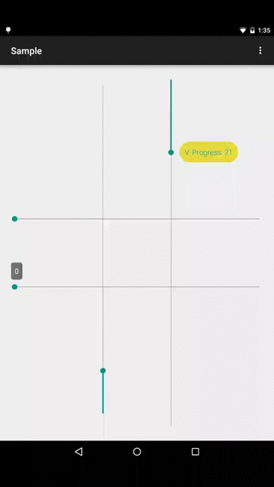

# ProgressHint
ProgressBar/SeekBar delegate to show floating progress with style




## Description
+ ``Library`` module provides a basic abstract ``ProgressHintDelegate`` which in conjunction with ``SeekBar``
 could show current progress in a floating styled window.
+ ``Library-addition`` module implements ``SeekBar`` and ``VerticalSeekBar`` with delegate support.

## Getting Started
**1)** In your `build.gradle`:

```gradle
repositories {
  jcenter()
  maven { url "https://jitpack.io" }
}
dependencies {
  compile 'com.github.techery.progresshint:library-addition:{jitpack-release}'
}
```

**2)** In view XML

```xml
<io.techery.progresshint.addition.widget.SeekBar
    android:layout_width="match_parent"
    android:layout_height="wrap_content"
    app:popupStyle="follow"
    />
```

or

```xml
<com.h6ah4i.android.widget.verticalseekbar.VerticalSeekBarWrapper
    android:layout_width="wrap_content"
    android:layout_height="match_parent"
    >
  <io.techery.progresshint.addition.widget.VerticalSeekBar
      android:layout_width="0dp"
      android:layout_height="0dp"
      app:seekBarRotation="CW90"
      app:popupStyle="follow"
      app:popupLayout="@layout/custom_seekbar_hint_popup"
      app:popupAlwaysShown="true"
      />
  <!-- Rotation: CW90 or CW270 -->
</com.h6ah4i.android.widget.verticalseekbar.VerticalSeekBarWrapper>
```

__Available attributes__

+ ``popupLayout``: layout to be used, must include ``android:id/text1 TextView``
+ ``popupStyle``: can be ``fixed`` or ``follow``, default `follow`
+ ``popupAnimationStyle``: in/out animation, default `fade`
+ ``popupOffset``: distance from top/right of the widget to popup, default `0`
+ ``popupAlwaysShown``: do not dismiss popup after _onStopTrackingTouch_, default `false`
+ ``popupDraggable``: enables progress change by hint popup dragging, default `true`

**3)** Optionally customize the displayed text in Java code:

```java
SeekBarHintDelegateHolder seekBar = (SeekBarHintDelegateHolder) findViewById(R.id.seekBar);
seekBar.getHintDelegate()
    .setHintAdapter(new SeekBarHintAdapter() {
      @Override public String getHint(android.widget.SeekBar seekBar, int progress) {
        return "Progress: " + String.valueOf(progress);
      }
    });
```

**4)** Optionally use `Theme` attribute

```xml
<style name="AppTheme" parent="Theme.AppCompat.Light.DarkActionBar">
    <item name="progressHintStyle">@style/Widget.ProgressHint</item>
</style>
```

## Credits
Thanks to
+ @moondroid for [inspiration](https://github.com/moondroid/SeekBarHint)
+ @h6ah4i for [VerticalSeekBar](https://github.com/h6ah4i/android-verticalseekbar)

## License

    Copyright (c) 2014 Techery

    Licensed under the Apache License, Version 2.0 (the "License");
    you may not use this file except in compliance with the License.
    You may obtain a copy of the License at

       http://www.apache.org/licenses/LICENSE-2.0

    Unless required by applicable law or agreed to in writing, software
    distributed under the License is distributed on an "AS IS" BASIS,
    WITHOUT WARRANTIES OR CONDITIONS OF ANY KIND, either express or implied.
    See the License for the specific language governing permissions and
    limitations under the License.
